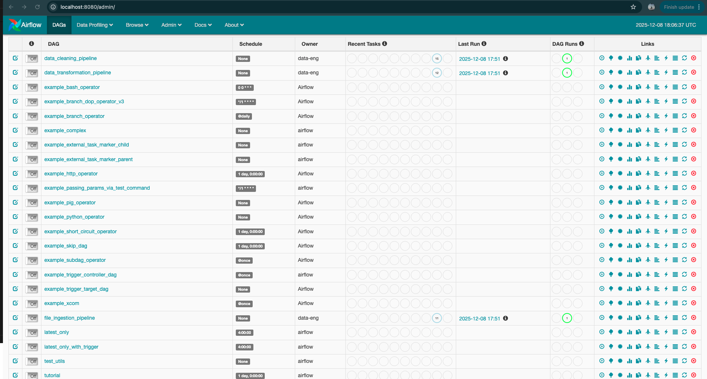

# EduFlow AI - Student Data Pipeline

End-to-end pipeline for the campus hiring data engineer assignment: ingests CSV files, cleans and transforms records, simulates streaming with Kafka, and enriches with an optional Groq LLM (stub fallback by default).

## Prerequisites
- Docker + Docker Compose
- Python 3.10+ (only needed to run unit tests locally)

## Quick start
```bash
# From repo root
cp .env.example .env  # fill GROQ_API_KEY if you want real LLM calls
docker-compose build airflow kafka
docker-compose up -d

# Airflow UI: http://localhost:8080 (default airflow/airflow)
# Prometheus: http://localhost:9090
# Postgres: localhost:5432 (user/password/db: eduflow/eduflowpass/eduflow)

# Trigger DAGs in order
docker-compose exec airflow airflow trigger_dag file_ingestion_pipeline
docker-compose exec airflow airflow trigger_dag data_cleaning_pipeline
docker-compose exec airflow airflow trigger_dag data_transformation_pipeline

# Verify counts after runs finish
docker-compose exec -T postgres psql -U eduflow -d eduflow -c "SELECT 'raw.students_enrollment', count(*) FROM raw.students_enrollment UNION ALL SELECT 'raw.student_progress', count(*) FROM raw.student_progress UNION ALL SELECT 'raw.course_catalog', count(*) FROM raw.course_catalog UNION ALL SELECT 'raw.support_tickets', count(*) FROM raw.support_tickets UNION ALL SELECT 'staging.stg_students', count(*) FROM staging.stg_students UNION ALL SELECT 'staging.stg_progress', count(*) FROM staging.stg_progress UNION ALL SELECT 'staging.stg_tickets', count(*) FROM staging.stg_tickets UNION ALL SELECT 'warehouse.dim_students', count(*) FROM warehouse.dim_students UNION ALL SELECT 'warehouse.dim_courses', count(*) FROM warehouse.dim_courses UNION ALL SELECT 'warehouse.dim_date', count(*) FROM warehouse.dim_date UNION ALL SELECT 'warehouse.fact_student_progress', count(*) FROM warehouse.fact_student_progress UNION ALL SELECT 'warehouse.fact_support_tickets', count(*) FROM warehouse.fact_support_tickets UNION ALL SELECT 'warehouse.fact_enrollments', count(*) FROM warehouse.fact_enrollments;"
```

### Local dev/test (outside Docker)
- Install minimal dev deps: `python -m pip install -r requirements-dev.txt`
- Run tests: `PYTHONPATH=. pytest -q tests`

## Current results (latest run)
- DAGs: ingestion ✅, cleaning ✅, transformation ✅
- Row counts (see `output/summary_report.md` for details):

| table | count |
| --- | ---: |
| raw.students_enrollment | 93 |
| raw.student_progress | 153 |
| raw.course_catalog | 30 |
| raw.support_tickets | 45 |
| staging.stg_students | 30 |
| staging.stg_progress | 50 |
| staging.stg_tickets | 15 |
| staging.stg_quality_log | 0 |
| warehouse.dim_date | 2557 |
| warehouse.dim_students | 30 |
| warehouse.dim_courses | 10 |
| warehouse.fact_student_progress | 50 |
| warehouse.fact_enrollments | 1 |
| warehouse.fact_support_tickets | 15 |

## Airflow DAGs
Mounted from `dags/` and `operators/` into the Airflow container.
- `file_ingestion_pipeline`: validates source files and ingests rows into `raw.*` tables.
- `data_cleaning_pipeline`: applies cleaning rules (student IDs, names, emails, phones, dates, gender, locations, numerics) and marks duplicates; also cleans progress/tickets into `staging.*`.
- `data_transformation_pipeline`: derives age fields, maps statuses, aggregates progress, runs AI enrichment stub, loads dimensions, and populates fact tables for student progress, enrollments, and support tickets.

Trigger DAGs in order: ingestion -> cleaning -> transformation.

### Database writes
- `file_ingestion_pipeline` loads raw CSV rows into `raw.*` tables.
- `data_cleaning_pipeline` upserts into `staging.stg_students`, `staging.stg_progress`, and `staging.stg_tickets` with quality flags.
- `data_transformation_pipeline` upserts enriched students into `warehouse.dim_students`, loads `warehouse.dim_courses`, and writes to `warehouse.fact_student_progress`, `warehouse.fact_enrollments`, and `warehouse.fact_support_tickets`.

## Data cleaning rules
Implemented in `dags/utils/cleaning_rules.py` and orchestrated by `dags/utils/cleaners.py`:
- Student ID standardization, name cleanup, email validation, phone normalization, date parsing, gender mapping, city/state cleanup with fuzzy match, numeric/score handling, duplicate detection, and quality scoring.

## Kafka streaming simulation
`kafka/streaming.py` contains:
- `EventSimulatorProducer` to publish CSV rows as events.
- `RealTimeProcessor` to clean events, detect anomalies, and forward to downstream topics.
- `StreamAggregator` for rolling metrics.

Bring up Kafka via `docker-compose up` then wire a simple producer/consumer script using these classes.

## AI agents (stubs)
`agents/langgraph_workflow.py` includes router, student risk scorer, support analyzer, quality analyzer, and insight generator placeholders. Replace with real LangGraph nodes or API calls as needed.
`AIEnrichmentOperator` will call `LANGGRAPH_ENDPOINT` if set (see `docker-compose.yml`) and emits Prometheus counters/histograms when `prometheus_client` is available; starts a metrics HTTP server on `METRICS_PORT` (default 8001).

### Real Groq LLM (optional)
- Add your key to `.env`: `GROQ_API_KEY=...` (model defaults to `mixtral-8x7b-32768`, override with `GROQ_MODEL`).
- `docker-compose` loads `.env` into the Airflow container; `AIEnrichmentOperator` will call Groq first and fall back to the local stub if missing or failing.

### Security
- `.env` is git-ignored; only `.env.example` is tracked. Never commit real keys.

## Metrics
- Prometheus config in `prometheus.yml`; `docker-compose` includes a `prometheus` service scraping `airflow:8001` and `kafka:8001`.

## Database schema
`init_db/init_schema.sql` builds raw, staging, warehouse, analytics, and metadata layers. Mounted automatically into Postgres on container start.

## Tests
Run lightweight unit tests locally:
```bash
python -m pip install pytest
PYTHONPATH=. pytest -q tests
```

## Artifacts
- Run summary and counts: `output/summary_report.md`
- Example env template: `.env.example`
- Dev/test dependencies: `requirements-dev.txt`

## Folder layout
- `dags/`: Airflow DAG definitions and cleaning utilities
- `operators/`: Custom Airflow operators (validation, cleaning, AI enrichment)
- `kafka/`: Streaming simulator classes
- `agents/`: AI/LangGraph workflow stubs
- `init_db/`: Warehouse schema
- `University Hiring Assignment -_ Data Engineer/`: Provided sample data

## Submission checklist
- Bring up services: `docker-compose up -d` (after build)
- Trigger DAGs in order (ingestion → cleaning → transformation)
- Confirm green runs in Airflow UI and non-zero counts via the query above
- Metrics: Prometheus scrapes `airflow:8001` and `kafka:8001`

## Run snapshots (text)
- Airflow DAG states (recent run):
	```
	dag_id                     state
	file_ingestion_pipeline    success
	data_cleaning_pipeline     success
	data_transformation_pipeline success
	```
- Row-count query output:
	```
					 table              | count
	----------------------------+-------
	raw.students_enrollment     |    93
	raw.student_progress        |   153
	raw.course_catalog          |    30
	raw.support_tickets         |    45
	staging.stg_students        |    30
	staging.stg_progress        |    50
	staging.stg_tickets         |    15
	warehouse.dim_students      |    30
	warehouse.dim_courses       |    10
	warehouse.dim_date          |  2557
	warehouse.fact_student_progress | 50
	warehouse.fact_support_tickets | 15
	warehouse.fact_enrollments  |     1
	```

## Airflow DAG execution screenshot


## Next steps
- Connect AI enrichment to a real endpoint with retries/metrics.
- Add Grafana dashboards and alerting rules on the Prometheus scrape targets.
